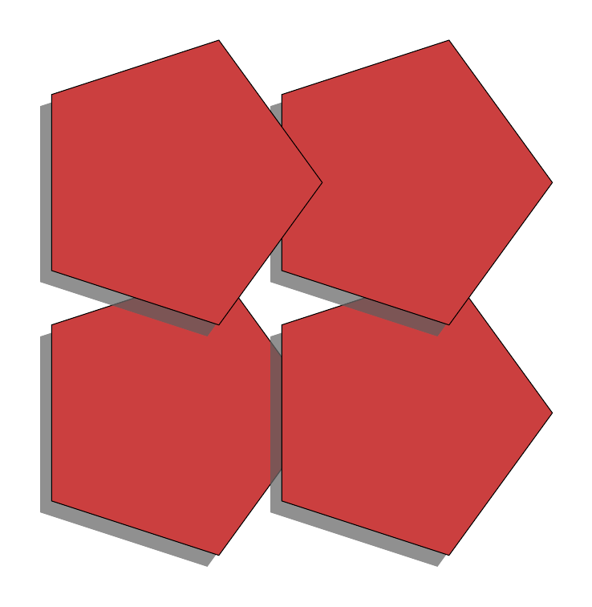

# lineplz

An experiment to render vector art using adaptively sampled distance. Inspired by the paper "Adaptively Sampled Distance Fields: A general representation of Shape for Computer Graphcs" by Sarah F. Frisken et all.

There's not much to document, it's a personal experiment. The interesting part is the adaptive sampling of distance fields in 2D using a quadtree - mainly because how elegant the solution is (not because how fast it is). 

This is not intended for booleans or any other fancy stuff. Each primitive is rendered to it's own "layer". The really cool thing about distance function is that you can trivially tune the smoothing function on a border to your hearts content.
The adaptively sampled quadtree is implemented in https://github.com/mkuitune/lineplz/blob/main/lnpz/lnpz_fieldquadtree.h and https://github.com/mkuitune/lineplz/blob/main/lnpz/lnpz_fieldquadtree.cpp.

samples/lnpz-samples.cpp is the main driver code for the existing test scenes. samples/ contains also some results of render tests such as

## Instructions

It's a cmake project with no external dependencies. You need a C++ compiler and CMake... Tested on Visual Studio, other compilers may or may not work.
